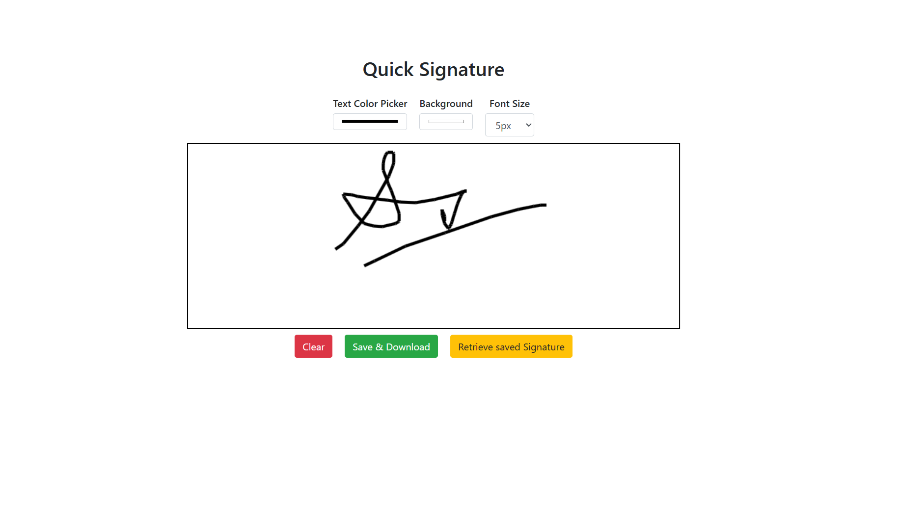

# ✍️ Quick Signature

Quick Signature is a simple, browser-based tool that allows you to create, draw, save, and retrieve digital signatures easily. It features customizable text color, background color, and brush (font) size — all on a single clean page.

## 🚀 Features

- ✏️ Draw using your mouse
- 🎨 Change pen color and canvas background
- 🔠 Adjust stroke (font) size
- 💾 Save your signature to local storage and download it as an image
- 🔁 Retrieve previously saved signature

## 🖼️ Screenshot




## 📂 Project Structure

QuickSignature/
├── index.html # Main HTML page
├── style.css # Styling using CSS and Bootstrap
├── script.js # Core drawing and logic handling
├── screenshot.png # Screenshot image for README
└── README.md # You're reading this!


## 📦 Tech Stack

- HTML5
- CSS3 (with Bootstrap 4)
- JavaScript (Vanilla)

## 🔧 Setup Instructions

1. Clone or download this repository.
2. Open `index.html` in any modern browser.
3. Draw your signature, adjust settings, and save/download!

```bash
git clone https://github.com/mayank26202/Quick-Signature-app.git
cd quick-signature
open index.html
